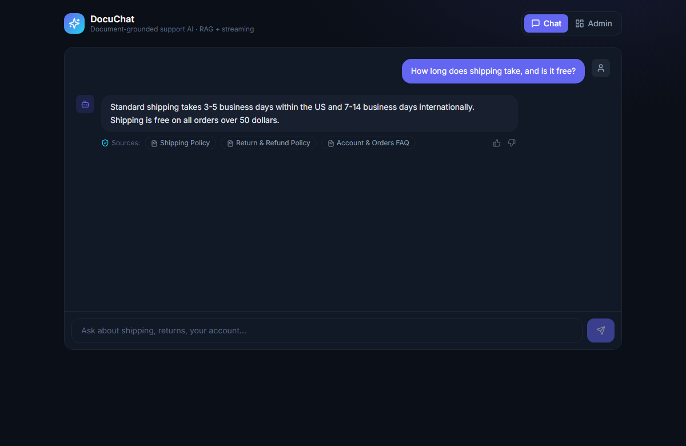

# DocuChat — Document-Grounded AI Support Chatbot (RAG)

A full-stack AI customer-support chatbot that answers **only from your documents**,
**streams** the answer token-by-token (ChatGPT-style typing), **cites its sources**,
and **refuses to hallucinate** — with an admin panel for uploading docs, reviewing
questions, and 👍/👎 feedback.

Built to mirror a real production support bot: **React (TypeScript) frontend + Python
(FastAPI) backend** doing retrieval-augmented generation (RAG).

🔗 **Live demo:** https://yagami-reverse.github.io/docuchat/ &nbsp;·&nbsp; **API:** https://docuchat-api-odw2.onrender.com
🖥️ **Frontend:** React 18 · TypeScript · Vite · Tailwind
🐍 **Backend:** Python · FastAPI · scikit-learn (TF-IDF retrieval) · SSE streaming

> ⏳ The API runs on a free tier that sleeps after inactivity — the **first** request may take ~30–50s to wake it, then it's fast. The app pings it on load to warm it up.



---

## ✨ What it does

- **RAG over your docs with real vector search** — documents are chunked, embedded (gte-small, 384-dim, via a Supabase Edge Function — zero API cost) and stored in **Postgres/pgvector**; retrieval is semantic cosine search, so "my parcel is late" finds the Shipping Policy even with zero shared keywords. TF-IDF remains as an automatic zero-config fallback.
- **File upload** — drop **.pdf, .txt or .md** files straight into the knowledge base from the admin panel (PDF text extraction via pypdf); the bot answers from them immediately.
- **Telegram interface** — the same bot, same knowledge base, in Telegram: [@docuchat_yagami_bot](https://t.me/docuchat_yagami_bot). Webhook-driven (FastAPI endpoint + Bot API), answers with source citations; every Telegram question shows up in the web admin log tagged `[tg]`.
- **Streaming answers (SSE)** — the reply types out live, like ChatGPT, via `text/event-stream`.
- **Source citations** — every grounded answer shows which document(s) it came from, with relevance scores.
- **No hallucination** — if nothing relevant is found, it clearly says so instead of inventing facts.
- **Admin panel** — add documents, see the knowledge base, review recent questions (grounded vs. unanswered), and 👍/👎 satisfaction stats.
- **LLM-optional** — runs **free** with an extractive answerer (no API key). Set `OPENAI_API_KEY` and the same retrieved context is handed to an LLM for a generated answer — still streamed, still cited.

## 🏗 Architecture

```
React (Vite, TS, Tailwind)  ──fetch + SSE──▶  FastAPI (Python)
  • chat UI + typing effect                    • /chat   → retrieve → stream (SSE)
  • source chips, 👍/👎                          • /docs   → upload / list
  • admin: upload, stats, logs                  • /feedback, /stats, /questions
                                                • TF-IDF retrieval (scikit-learn)
                                                • optional OpenAI streaming
```

## 🚀 Run locally

**Backend** (Python 3.11+):
```bash
cd backend
python -m venv .venv && .venv\Scripts\activate      # (macOS/Linux: source .venv/bin/activate)
pip install -r requirements.txt
uvicorn app:app --reload --port 8000
# optional real LLM:  set OPENAI_API_KEY=sk-...
```

**Frontend:**
```bash
cd frontend
npm install
npm run dev        # http://localhost:5173/docuchat/  (talks to http://127.0.0.1:8000)
```

## 🧪 E2E tests (Playwright)

The suite in `frontend/e2e/` runs against the **deployed app** (override with `E2E_BASE_URL`) on desktop + mobile emulation, and covers the money paths: streamed grounded answers with source citations, suggestion chips, honest refusal on out-of-KB questions, and the admin panel's knowledge base + quality stats. Global setup pre-warms the Render backend so cold starts never eat the test budget.

```bash
cd frontend
npx playwright install chromium
npm run test:e2e          # 10 checks: 5 specs × (desktop + mobile)
npm run test:e2e:report   # open the HTML report
```

## 📦 Deploy

- **Frontend → GitHub Pages** (static). Set the repo variable `VITE_API_URL` to your deployed backend URL, then the included GitHub Actions workflow builds & publishes.
- **Backend → Render / Hugging Face Spaces** (Python can't run on Pages). See `render.yaml` for a one-click Render Web Service (build `pip install -r requirements.txt`, start `uvicorn app:app --host 0.0.0.0 --port $PORT`).

## 🔍 Notes

- Retrieval is dependency-light TF-IDF so the demo runs with **zero API cost**; swap in embeddings + pgvector for production scale.
- Storage is in-memory for the demo (seeded with sample store docs) — swap for Postgres/Supabase in production.

---

*Portfolio project. Sample store content is fictional.*
